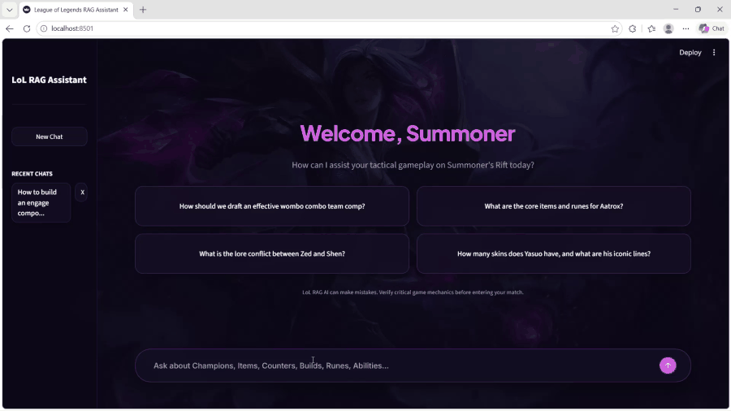

# ⚔️ League of Legends Hybrid GraphRAG AI Assistant

A production-grade **Hybrid GraphRAG** tactical coach and conversational assistant for **League of Legends**, combining **Neo4j Knowledge Graph**, **fine-tuned LoRA dense retrieval (FAISS)**, **cross-encoder neural re-ranking**, and **multi-store persistence** behind a sleek **Void Glassmorphism UI**.



---

## 🛠️ Tools & Technologies Used

The assistant is built on a high-performance, modular AI & Data ecosystem:

* **LLM Inference**: **[Ollama](https://ollama.com/)** running **Qwen 2.5 / 3 4B** locally for fast, privacy-preserving tactical reasoning and conversational synthesis.
* **Knowledge Graph**: **[Neo4j](https://neo4j.com/)** with **Cypher** queries to traverse complex multi-hop relationships (champion counters, duo synergies, item builds, and team composition dynamics).
* **Vector Store**: **[Meta FAISS](https://github.com/facebookresearch/faiss)** (`faiss-cpu`) providing sub-millisecond dense semantic retrieval across 2,500+ tactical knowledge chunks.
* **Domain Embeddings**: **`BAAI/bge-small-en-v1.5`** fine-tuned via **LoRA (PEFT)** on curated League of Legends domain triplets.
* **Neural Re-ranker**: **`cross-encoder/ms-marco-MiniLM-L-6-v2`** to score and prioritize combined graph and vector candidates before generation.
* **Document Store**: **[MongoDB](https://www.mongodb.com/)** storing unified JSON schemas for 173 champions, 254 items, rune trees, and detailed ability mechanics.
* **Chat Persistence**: **[PostgreSQL](https://www.postgresql.org/)** managing conversation histories, user sessions, and latency metrics.
* **Frontend UI**: **[Streamlit](https://streamlit.io/)** crafted with custom Void Glassmorphism styling (Kai'Sa aesthetic), recommendation cards, and session history management.
* **ETL & Data Gathering**: **Requests**, **BeautifulSoup4**, and **PyYAML** ingesting and merging multi-source data from Riot Data Dragon, Community Dragon, Meraki Analytics, OP.GG, and Blitz.gg.

---

## 🧠 Relationship & Knowledge Modeling

Rather than relying purely on flat text chunks, the system constructs an **interconnected Knowledge Graph (Neo4j)** and relational matrices from raw multi-source data:

* **Counters & Matchups (`COUNTERS`)**: Models lane advantages, win-rate deltas, and tactical counter reasoning (e.g., range poke advantage, shield-breaking, anti-sustain).
* **Duo Synergies (`SYNERGIZES_WITH`)**: Maps high-synergy champion pairs (Bot-Support, Mid-Jungle) with complementary mechanics (e.g., CC chaining, engage + AoE burst).
* **Itemization & Rune Paths (`USES_ITEM`, `USES_RUNE`)**: Links champions to core/situational item builds and rune trees based on playstyles and damage profiles.
* **Ability & Crowd Control Mechanics (`HAS_ABILITY`, `HAS_CC`)**: Associates spells with scaling formulas, cooldowns, and CC types (Airborne, Stun, Silence).
* **Composition Counter Matrices (`COUNTERS_COMP`)**: Connects 20 strategic team composition archetypes (Wombo Combo, Poke/Siege, Split Push, Protect Hypercarry) with strategic counter-play dynamics.

This graph-based relationship structure enables **multi-hop Cypher queries**, allowing the assistant to reason across interconnected entities that traditional vector-only RAG misses.

---

## ⚡ Quick Start

### 1. Prerequisites
Ensure you have the following minimum versions installed and running:
* **Python**: `>= 3.10`
* **Ollama**: `>= 0.1.30`
* **MongoDB**: `>= 6.0`
* **Neo4j**: `>= 5.0`
* **PostgreSQL**: `>= 14.0`

### 2. Installation & Environment
```bash
# Clone & install dependencies
git clone https://github.com/NhoHangoodkid/League-of-Legends-RAG-Chatbot.git
cd "League-of-Legends-RAG-Chatbot"
python -m venv venv
.\venv\Scripts\activate   # Linux/macOS: source venv/bin/activate
pip install -r requirements.txt

# Configure environment variables
cp .env.example .env
```
*(Edit `.env` with your database credentials and Ollama endpoint if different from default)*.

### 3. Launch the Application
```bash
# Web UI (Streamlit - Recommended)
streamlit run app/streamlit_app.py

# Or Terminal CLI
python app/cli.py
```
Access the web interface at **`http://localhost:8501`**.

---

## License & Disclaimer

* **License**: MIT License.
* **Disclaimer**: This project is not affiliated with or endorsed by Riot Games. League of Legends and all related assets are trademarks or registered trademarks of Riot Games, Inc.
